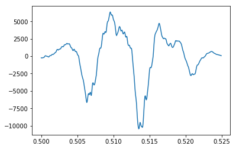
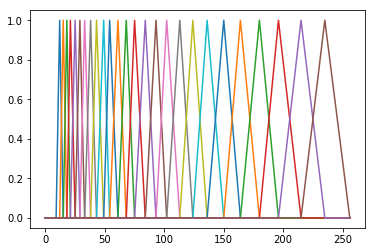

# Speech Recognition Project
We want to make a monophone recognition system.
Train and test data are available in the `database` folder.

First of all, we need to convert all other notebooks to scripts so we can use the functions we defined in them.


```python
!jupyter nbconvert --to script --output-dir=py_speech *.ipynb
```

    [NbConvertApp] Converting notebook Speech Recognition Project.ipynb to script
    [NbConvertApp] Writing 4408 bytes to py_speech/Speech Recognition Project.py
    [NbConvertApp] Converting notebook feature_extractor.ipynb to script
    [NbConvertApp] Writing 11331 bytes to py_speech/feature_extractor.py
    [NbConvertApp] Converting notebook hmm.ipynb to script
    [NbConvertApp] Writing 368 bytes to py_speech/hmm.py


## Preprocessing and Feature Extraction
Frist, we're going to get sound files as input.
To do that, we need to find the name of all train files then store samples for each one in a Python dictionary.


```python
import os
import numpy as np

# import functions from other notebooks
from py_speech import feature_extractor, hmm

TRAIN_DATA_DIR = os.path.join(os.curdir, 'database', 'train')
SPEAKER_LIST = [d for d in os.listdir(TRAIN_DATA_DIR)
                if os.path.isdir(os.path.join(TRAIN_DATA_DIR, d))]

# store filenames in this list
train_filenames = []
for s in SPEAKER_LIST:
    train_filenames.extend(
        [os.path.join(s, f)
             for f in os.listdir(os.path.join(TRAIN_DATA_DIR, s))
                            if f.endswith('.wav')]
    )
train_filenames.sort()
```

Read each file and store the frames in a list.


```python
STEP_SIZE = 0.01
FRAME_LENGTH = 0.025

samples = {}
for filename in train_filenames:
    samples[filename] = feature_extractor.get_frames_from_file(
            os.path.join(TRAIN_DATA_DIR, filename),
            STEP_SIZE,
            FRAME_LENGTH
        )[0]
```

Here we just plot one of the frames to show the imported signal (just as an example).


```python
import matplotlib.pyplot as plt
import seaborn as sns

SAMPLE_RATE = 16000 # because we already tested
                    # and know that train data
                    # are sampled at 16 KHz

frame_number = 50
plt.plot(np.linspace(0, FRAME_LENGTH,
                     int(SAMPLE_RATE * FRAME_LENGTH),
                     endpoint=False) + frame_number * STEP_SIZE,
        list(samples.values())[0][frame_number])
plt.show()
```





### Mel Frequency Cepstral Coefficients (MFCCs)

We have defined functions to extract MFCC in `feature_extractor` module.
Look at the corresponding notebook for more detail.

For testing purposes, we plot Mel filter banks here:


```python
for filt in feature_extractor.get_mel_filterbanks():
    plt.plot(filt)
plt.show()
```





### Normalize Features
Next thing, we should normalize feature parameters for each speaker. So we first define a function which gives all features for a specific speaker. Then we define two functions which give mean and variance of features for a speaker.


```python
def get_features_for_speaker(features, speaker):
    """
    Given the features dictionary,
    this function will find the features for a specific speaker.
    
    Parameters
    ----------
    features : dict
        a dictionary that contains features for every train file.
        keys of this dictionary is expected to be in this form:
        <speaker_name>/<file_name>
    speaker : string
        the speaker we're looking for.
    
    Returns
    -------
    list
        a list of all files from that given speaker.
    
    Raises
    ------
    ValueError
        if the given speaker is not in the list,
        will raise an error.
    """
    if speaker not in SPEAKER_LIST:
        raise ValueError(
            "Invalid speaker. Expected one of: %s" % SPEAKER_LIST)
    
    ft = []
    for key in features:
        if key.startswith(speaker):
            ft.extend(features[key])
    
    return ft

# these two functions are used to return
# mean and variance for each speaker.
mean_for_speaker = lambda f, s: np.mean(
    get_features_for_speaker(f, s), axis=0)
var_for_speaker = lambda f, s: np.var(
    get_features_for_speaker(f, s), axis=0)
```

Now that we're finished, we can easily extract features of all the train files and store it in a global variable. Then we use our recently defined functions to normalize these values.


```python
features = {key: feature_extractor.mfcc(samples[key])
            for key in samples}

mean = {sp: mean_for_speaker(features, sp)
        for sp in SPEAKER_LIST}
var = {sp: var_for_speaker(features, sp)
       for sp in SPEAKER_LIST}

for key in features:
    speaker = os.path.split(key)[0]
    features[key] = np.array([(f - mean[speaker]) / var[speaker]
                              for f in features[key]])
```
